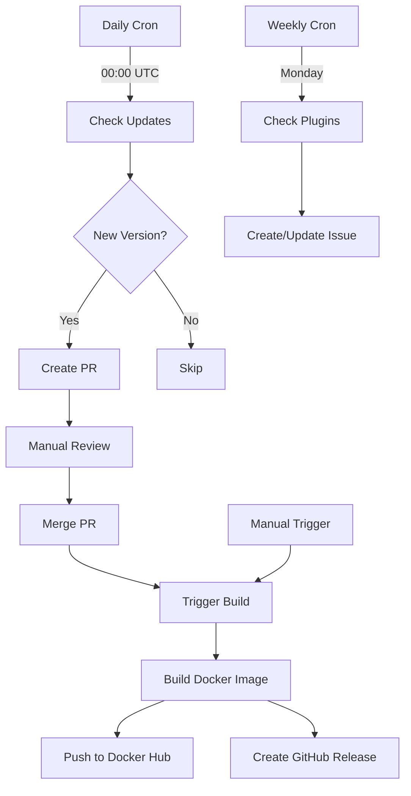

# GitHub Actions Workflows

This directory contains automated workflows for maintaining and publishing the Docker WebDAV image.

## Workflows

### 1. Check for Updates (`check-updates.yml`)

**Trigger**: Daily at 00:00 UTC (or manually)

**Purpose**: Automatically checks for new Caddy releases and creates a pull request when updates are available.

**Process**:
1. Fetches the current version from `version.txt`
2. Queries the Caddy GitHub repository for the latest release
3. Compares versions and creates a PR if an update is available
4. Updates both `version.txt` and `Dockerfile` with the new version

**Manual Trigger**: 
```bash
gh workflow run check-updates.yml
```

### 2. Build and Publish Docker Image (`docker-publish.yml`)

**Trigger**: 
- Push to main branch (when `version.txt`, `Dockerfile`, or `Caddyfile-*` changes)
- Pull request to main branch
- Manual dispatch

**Purpose**: Builds and publishes the Docker image to Docker Hub and creates a GitHub release.

**Process**:
1. Reads version from `version.txt`
2. Builds multi-platform Docker image (amd64, arm64)
3. Pushes to Docker Hub with version tag and `latest` tag
4. Creates a GitHub release with version information

**Manual Trigger**:
```bash
gh workflow run docker-publish.yml
```

### 3. Check Plugin Updates (`check-plugin-updates.yml`)

**Trigger**: Weekly on Monday at 00:00 UTC (or manually)

**Purpose**: Monitors the status of Caddy plugins used in the image.

**Process**:
1. Checks the latest commit of `mholt/caddy-webdav`
2. Checks the latest release/commit of `caddy-dns/cloudflare`
3. Creates/updates a GitHub issue with the plugin status report

**Note**: Plugins are automatically pulled at their latest versions during the Docker build process with `xcaddy`. This workflow is informational only.

**Manual Trigger**:
```bash
gh workflow run check-plugin-updates.yml
```

## Workflow Integration



## Required Secrets

The following secrets must be configured in the repository settings:

- `DOCKER_HUB_USERNAME`: Docker Hub username
- `DOCKER_HUB_ACCESS_TOKEN`: Docker Hub access token
- `GITHUB_TOKEN`: Automatically provided by GitHub Actions

## Configuration

### Automatic Update Frequency

To change how often updates are checked, modify the cron schedule in `check-updates.yml`:

```yaml
on:
  schedule:
    - cron: '0 0 * * *'  # Daily at 00:00 UTC
```

Common cron patterns:
- `0 0 * * *` - Daily at midnight
- `0 0 * * 1` - Weekly on Monday
- `0 0 1 * *` - Monthly on the 1st

### Plugin Check Frequency

Similarly, modify `check-plugin-updates.yml` to change the plugin check frequency.

## Maintenance

### Testing Workflows

You can test workflows without waiting for scheduled runs:

1. Go to Actions tab in GitHub
2. Select the workflow you want to test
3. Click "Run workflow"
4. Choose the branch and click "Run workflow"

### Debugging

- Check workflow runs in the Actions tab
- Review job logs for detailed error messages
- Use `workflow_dispatch` trigger for manual testing

## Benefits

1. **Automated Updates**: Stay up-to-date with the latest Caddy releases automatically
2. **Multi-platform Support**: Builds for both amd64 and arm64 architectures
3. **Version Tracking**: Automatically creates GitHub releases with version information
4. **Plugin Monitoring**: Keep track of plugin updates and changes
5. **Pull Request Workflow**: Review changes before they're merged
6. **Docker Hub Integration**: Automatically publish to Docker Hub with proper tagging
